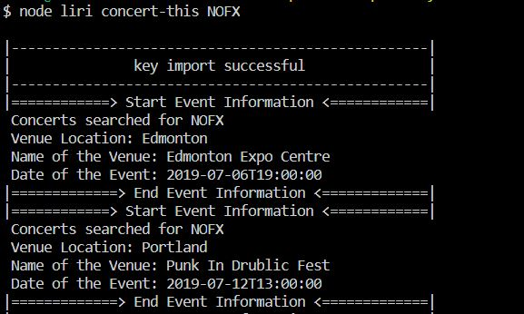
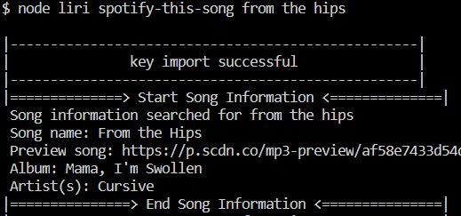
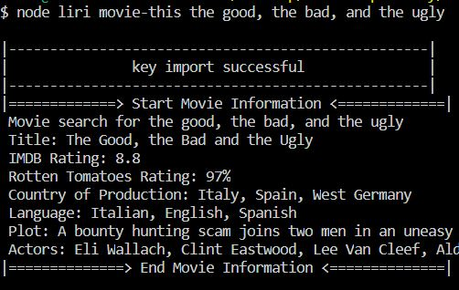

LIRI is like iPhone's SIRI. However, while SIRI is a Speech Interpretation and Recognition Interface, LIRI is a Language Interpretation and Recognition Interface. LIRI will be a command line node app that takes in parameters and gives you back data.

LIRI will search Spotify for songs, Bands in Town for concerts, and OMDB for movies.

Use the commands "node liri" to clarify the program.

examples:

`concert-this`

`spotify-this-song'

`movie-this`

try `do-what-it-says` to acess random.txt and look up that song!
